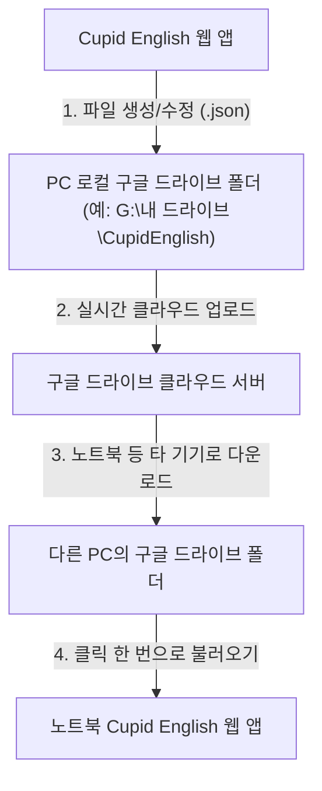

# ☁️ Cupid English 구글 드라이브(Google Drive) 동기화 가이드

안녕하세요! Cupid English 학습자 여러분의 소중한 학습 데이터를 안전하게 보관하고, 여러 기기(데스크톱, 노트북 등)에서 자유롭게 이어 하실 수 있도록 **구글 드라이브 동기화 기능**을 제공하고 있습니다.

이 가이드는 **노트북이나 다른 PC에서 구글 드라이브 폴더를 연결하여 데이터를 실시간으로 동기화하고 연동하는 과정**을 상세하게 안내합니다.

---

## 💡 동기화 원리 이해하기
본 프로그램은 서버에 데이터를 저장하지 않고, **웹 브라우저의 최신 기술(Web File System Access API)을 사용하여 사용자의 PC 폴더에 직접 데이터를 저장**합니다. 
따라서 구글 드라이브와 연동하려면 **"PC용 구글 드라이브 앱"**이 설치되어 있어야 합니다.

---

## 🚀 구글 드라이브 동기화 3단계 설정 방법

### 1단계: PC용 구글 드라이브(Google Drive for Desktop) 앱 설치
웹 브라우저가 컴퓨터의 구글 드라이브 폴더를 직접 인식할 수 있도록 PC용 앱을 먼저 설치해야 합니다.

1. **구글 드라이브 다운로드 페이지**에 접속합니다.
   * [PC용 Google Drive 다운로드](https://www.google.com/drive/download/)
2. **`Windows용 Drive 다운로드`** 버튼을 눌러 설치 파일을 다운로드하고 설치를 진행합니다.
3. 설치가 완료되면 구글 계정으로 로그인합니다.
4. 로그인 후 내 컴퓨터 탐색기(윈도우 키 + E)를 열었을 때 **`Google Drive (G: 또는 H: 등)`** 또는 **내 드라이브**라는 가상 드라이브가 생성되었는지 확인합니다.

---

### 2단계: 구글 드라이브 내에 전용 폴더 만들기
학습 데이터가 깔끔하게 보관될 전용 폴더를 만들어 줍니다.

1. 파일 탐색기를 열고 **`Google Drive (G: 또는 H:)`** ➔ **`내 드라이브`** (My Drive)로 이동합니다.
2. 마우스 우클릭을 하여 **새 폴더**를 생성하고, 이름을 **`CupidEnglish`**로 지정합니다.
   * *경로 예시: `G:\내 드라이브\CupidEnglish` 또는 `H:\내 드라이브\CupidEnglish`*

---

### 3단계: Cupid English 프로그램에서 폴더 연동하기
이제 프로그램과 방금 만든 구글 드라이브 폴더를 연결합니다.

1. **Cupid English 프로그램**을 실행합니다.
2. 상단 네비게이션 바 우측의 **`💻 PC 폴더`** 또는 **`☁️ Google Drive`** 버튼을 클릭하여 설정 모달을 엽니다.
3. 첫 번째 탭인 **`☁️ 구글 드라이브 / 클라우드`**를 선택합니다.
4. **`☁️ 구글 드라이브 / 클라우드 폴더 지정하기`** (또는 **`다른 새 폴더 선택`**) 버튼을 클릭합니다.
5. 브라우저의 폴더 선택 창이 뜨면, **`Google Drive (G: 또는 H:)`** ➔ **`내 드라이브`** ➔ **`CupidEnglish`** 폴더를 선택하고 **`폴더 선택`** 버튼을 누릅니다.
6. 브라우저 상단에 **"이 사이트에서 파일 수정을 허용하시겠습니까?"**라는 권한 요청 창이 뜨면 반드시 **`파일 보기 및 변경` (또는 `허용`/`예`)**을 선택해 줍니다.
7. 완료되면 화면에 **"☁️ Google Drive / 클라우드 폴더 [CupidEnglish]와 자동 동기화되었습니다!"**라는 알림이 표시됩니다.

---

## ⚠️ 필수 확인 및 문제 해결 (Q&A)

### Q1. 브라우저를 새로고침하거나 다시 접속하니 "연동 승인하기" 버튼이 뜹니다. 오류인가요?
> [!NOTE]
> **오류가 아닌 웹 브라우저의 보안 정책입니다.**
> 웹 브라우저는 사용자의 PC 파일을 안전하게 보호하기 위해, 사이트가 다시 열릴 때마다 **"기존 폴더 사용 권한을 다시 요청"**합니다.
> 이때는 당황하지 마시고 **`⚡ 기존 폴더 [CupidEnglish] 연동 승인하기`** 버튼을 누른 후, 브라우저 상단의 **`허용`** 버튼을 한 번만 클릭해 주시면 즉시 데이터가 복원됩니다.

### Q2. 노트북과 데스크톱 양쪽에서 데이터를 같이 쓰고 싶습니다. 어떻게 하나요?
> [!IMPORTANT]
> 1. 양쪽 PC 모두 **PC용 구글 드라이브 앱**이 설치되어 로그인되어 있어야 합니다.
> 2. 양쪽 PC에서 Cupid English 프로그램 접속 후, 똑같이 구글 드라이브 안의 **`CupidEnglish` 폴더**를 선택해 줍니다.
> 3. 한쪽에서 학습 자료를 추가/완료하면 구글 드라이브 앱이 클라우드로 동기화하며, 다른 PC에서 프로그램을 열어 **승인 버튼**을 누르면 자동으로 가장 최신 데이터가 반영됩니다.

### Q3. 폴더를 선택하려고 하는데 지원하지 않는 브라우저라고 나옵니다.
> [!WARNING]
> 본 폴더 연동 기능은 크롬 엔진 기반의 브라우저에서만 작동합니다.
> * **지원 브라우저**: 구글 크롬(Google Chrome), 마이크로소프트 엣지(Microsoft Edge), 네이버 웨일(Whale), 오페라(Opera) 등
> * **미지원 브라우저**: 파이어폭스(Firefox), 사파리(Safari - Mac/iPhone), 인터넷 익스플로러, 모든 모바일 브라우저
> 
> 만약 파이어폭스, 사파리 또는 스마트폰(모바일)에서 사용하고 싶으시다면, **`📦 백업 & 복원 (.json)`** 탭을 이용해 주세요. 수동으로 백업 파일을 내보내고(Export) 불러오는(Import) 방식으로 데이터를 옮기실 수 있습니다.

### Q4. 구글 드라이브 폴더에 어떤 파일들이 생기나요?
* **`_vault_meta.json`**: 마스터(학습 완료)한 문장 개수 등 기본 메타 정보 파일입니다.
* **`그 외 .json 파일들`**: 개별 학습 카드 파일입니다. 이 파일들이 하나씩 생성되어 구글 클라우드로 실시간 저장됩니다. 
* 파일 이름이나 내용을 임의로 수정하면 프로그램에서 불러오지 못할 수 있으니 주의해 주세요!

---

💡 **추천 팁**: 구글 드라이브 앱의 동기화 방식이 **"파일 스트리밍"**이나 **"파일 미러링"** 중 어떤 것으로 되어 있든 상관없이 정상 작동합니다. 노트북을 외부로 가지고 나가실 때 노트북에 인터넷(와이파이 또는 핫스팟)이 연결되어 있어야 클라우드 최신 본이 동기화된다는 점을 기억해 주세요!
